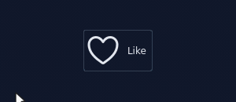
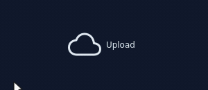
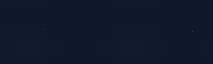
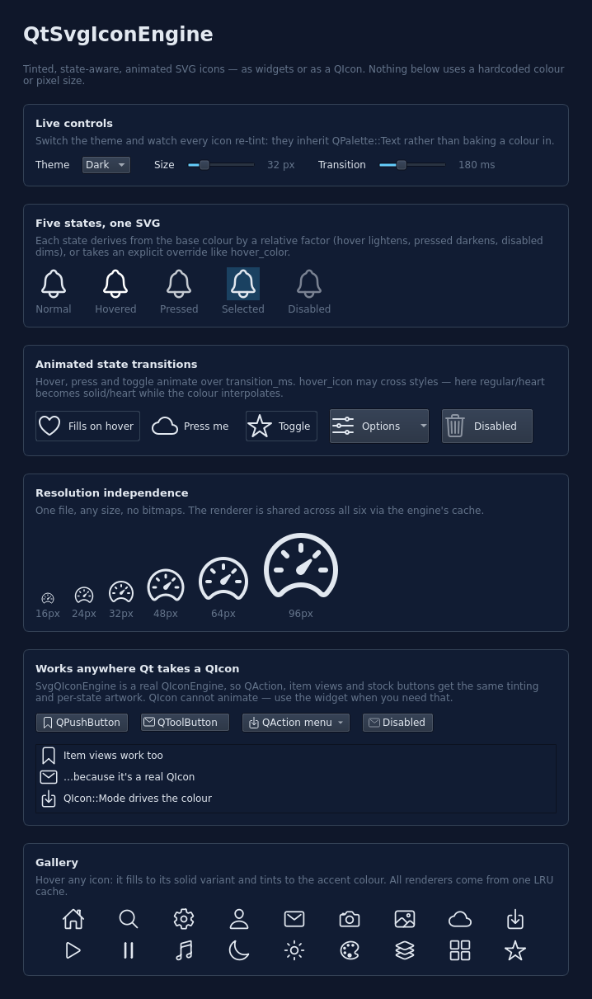

# QtSvgIconEngine

SVG icons for Qt that follow the palette, carry per-state colours and artwork, and animate.

Qt renders an SVG icon to a static bitmap. This library keeps the renderer around, so an
icon can be tinted from `QPalette`, given different artwork per interaction state, and
animated between states. The result is available as a `QWidget` (animatable) and as a
`QIconEngine`, so it works anywhere Qt takes a `QIcon` — `QAction`, `QPushButton::setIcon`,
item views.

| Hover | Press | Theme |
|:---:|:---:|:---:|
|  |  |  |





## Requirements

Qt 6.5 or newer (`Widgets`, `SvgWidgets`), CMake 3.21 or newer, a C++17 compiler.

Qt 6.5 builds on Linux only. Windows and macOS need Qt 6.6 or newer — Qt 6.5 does not compile
with the current MSVC STL, and its macOS build links a framework Apple has removed. CI covers
Linux on 6.5 and 6.8, and Windows and macOS on 6.8.

## Quick start

```cpp
#include <SvgIconEngine/SvgIconEngine.h>
#include <SvgIconEngine/SvgIconButton.h>

// The icon bank: a filesystem directory or a qrc prefix.
SvgIconEngine icons(":/icons");

// As a QIcon.
QPushButton *save = new QPushButton(icons.icon("regular/save"), "Save");

// As a widget, with per-state artwork and colour.
QVariantMap opts;
opts["size"]        = QSize(24, 24);
opts["hover_icon"]  = "solid/heart";
opts["hover_color"] = QColor("#f43f5e");
auto *like = new SvgIconButton(icons.getIcon("regular/heart", opts), "Like");
```

Neither icon sets `color`, so both inherit `QPalette::Text` and re-tint on a theme change.

## Icon paths

Icons are addressed by path. The `.svg` suffix is optional.

```cpp
icons.icon("regular/heart");        // <root>/regular/heart.svg
icons.icon("regular/heart.svg");    // the same
icons.icon(":/other/logo.svg");     // qrc, ignoring the bank
icons.icon("/usr/share/x.svg");     // filesystem, ignoring the bank
```

In a per-state option, a bare name resolves as a sibling of the base icon; a name containing
a slash resolves against the bank root.

```cpp
opts["hover_icon"] = "heart";        // regular/heart.svg
opts["hover_icon"] = "solid/heart";  // solid/heart.svg
```

## States

`Normal`, `Hovered`, `Pressed`, `Selected`, `Disabled`.

Any visual option can be overridden per state with a `hover_`, `pressed_`, `selected_` or
`disabled_` prefix. States without an override are derived from the `Normal` value, so a
palette change propagates automatically.

```cpp
QVariantMap o;
o["color"]         = QColor("#94a3b8");   // omit to inherit QPalette::Text
o["hover_color"]   = QColor("#38bdf8");
o["pressed_scale"] = 0.85;
o["selected_icon"] = "solid/star";
o["transition_ms"] = 180;                 // 0 for an instant switch
```

`SvgIconButton` sets the state from its own (`disabled` > `pressed` > `hovered` > `checked`).
Otherwise call `icon->setState(SvgIcon::Hovered)`.

### Options

| Key | Type | Default |
|---|---|---|
| `size` | `QSize` | the SVG's `defaultSize()` |
| `color` | `QColor` | inherits `QPalette::Text` |
| `background` | `QColor` | transparent |
| `opacity` | `qreal` | `1.0` |
| `scale` | `qreal` | `1.0` |
| `border_color` | `QColor` | inherits `QPalette::Text` |
| `border_width` | `qreal` | `0.0` |
| `default_colors` | `bool` | `false`; `true` keeps the file's own colours |
| `transition_ms` | `int` | `150` |
| `stroke_progress` | `qreal` | `1.0` (see [Stroke effects](#stroke-effects)) |
| `dash_pattern` | `qreal` | `0.0`, disabled |
| `dash_offset` | `qreal` | `0.0` |

`hover_icon`, `pressed_icon`, `selected_icon` and `disabled_icon` take a path and give the
state its own artwork.

Derived states are tuned by:

| Key | Default | Effect |
|---|---|---|
| `hover_lighten` | `130` | `QColor::lighter()` factor for `Hovered` |
| `pressed_darken` | `115` | `QColor::darker()` factor for `Pressed` |
| `disabled_opacity_factor` | `0.5` | opacity multiplier for `Disabled` |
| `selected_wash_alpha` | `60` | alpha of the `QPalette::Highlight` wash behind `Selected` |

## Stroke effects

`stroke_progress` runs from `0` (undrawn) to `1` (fully drawn).

```cpp
QVariantMap o;
o["size"]            = QSize(48, 48);
o["stroke_progress"] = 0.0;
SvgIcon *icon = icons.getIcon("regular/star", o);

auto *draw = new QPropertyAnimation(icon, "stroke_progress", icon);
draw->setDuration(800);
draw->setStartValue(0.0);
draw->setEndValue(1.0);
draw->setEasingCurve(QEasingCurve::InOutCubic);
draw->start();
```

It is a `Q_PROPERTY`, so it works with `QPropertyAnimation`, with `animateTo()`, and as a
per-state override:

```cpp
QVariantMap o;
o["stroke_progress"]       = 0.35;   // partially drawn at rest
o["hover_stroke_progress"] = 1.0;    // completes on hover
o["transition_ms"]         = 400;
auto *btn = new SvgIconButton(icons.getIcon("regular/heart", o), "Like");
```

A fixed dash with an animated offset gives marching ants:

```cpp
QVariantMap o;
o["size"]         = QSize(48, 48);
o["dash_pattern"] = 36.0;            // dash length, in SVG user units
SvgIcon *icon = icons.getIcon("regular/cloud", o);

auto *ants = new QPropertyAnimation(icon, "dash_offset", icon);
ants->setDuration(1400);
ants->setStartValue(0.0);
ants->setEndValue(72.0);             // one dash + gap period
ants->setLoopCount(-1);
ants->start();
```

Implementation: `stroke-dasharray` and `stroke-dashoffset` are inherited properties, so they
are injected once on the root `<svg>` element rather than parsing the path data. An icon's
path length is recovered by bisecting on rendered coverage — the smallest dash that renders
nothing is the longest subpath — and memoised per file.

Each animated frame re-renders the SVG, which is considerably more expensive than animating
a colour. It is fine for a few icons; avoid animating many at once. Icons that use no stroke
effect never pay for this.

A filled icon has no stroke to draw. It reports a stroke length of `0`, logs a warning, and
ignores the effect rather than rendering blank. Query it with `icons.strokeLength(path)` or
`icon->strokeLength()`.

## Widget or QIcon

```cpp
SvgIcon *w = icons.getIcon("regular/heart", opts);   // QWidget
QIcon    i = icons.icon("regular/heart", opts);      // QIcon
```

`QIcon::Mode` maps onto the state model:

| `QIcon::Mode` | `SvgIcon::State` |
|---|---|
| `Normal` | `Normal` |
| `Active` | `Hovered` |
| `Selected` | `Selected` |
| `Disabled` | `Disabled` |

A `QIcon` has no pressed mode and cannot animate; it is a pixmap factory. Use the widget for
either. Tinting, per-state artwork, palette inheritance, sprites and HiDPI behave identically
through both.

## Sprites

Render one element of a sprite sheet by `id`. The element is tinted, animated and state-aware
like a whole file.

```cpp
SvgIcon *w = icons.getIconFromSprite("sheets/toolbar.svg", "cut");
QIcon    i = icons.iconFromSprite("sheets/toolbar.svg", "paste");
```

## Caching

Parsing an SVG dominates the cost of creating an icon, so renderers are held in an LRU cache
and shared between every icon using the same file.

```cpp
icons.setCacheLimit(200);   // renderers to keep; 0 disables the cache
icons.clearCache();
```

The cache holds a reference rather than owning the renderer, so eviction is safe: a renderer
still in use by a live icon stays alive until the last icon using it is destroyed.

## HiDPI

Both the widget and the `QIconEngine` rasterise at the screen's `devicePixelRatio`. On Qt 6.6
and newer the widget also re-rasterises when the window moves to a display with a different
scale factor; on 6.5 it keeps the ratio it was created with.

The scale-sensitive tests run at `QT_SCALE_FACTOR=2` as well as `1`, on every CI platform.

## Building

```sh
cmake -S . -B build
cmake --build build
ctest --test-dir build
./build/test/SvgIconEngineTest    # demo
```

`BUILD_SHARED_LIBS=ON` builds a shared library. `SVGICONENGINE_BUILD_TESTS` and
`SVGICONENGINE_BUILD_DEMO` default to `ON` only when this is the top-level project.

## Using it

Installed:

```sh
cmake --install build --prefix /usr/local
```

```cmake
find_package(SvgIconEngine 0.2 REQUIRED)
target_link_libraries(myapp PRIVATE SvgIconEngine::SvgIconEngine)
```

Vendored:

```cmake
add_subdirectory(third_party/QtSvgIconEngine)
target_link_libraries(myapp PRIVATE SvgIconEngine::SvgIconEngine)
```

The images in this README are regenerated with:

```sh
cmake -S . -B build -DSVGICONENGINE_BUILD_TOOLS=ON
cmake --build build --target make_docs SvgIconEngineTest
./tools/make_docs.sh build        # requires ffmpeg
```

## Not implemented

- Cross-fading between a state's artwork and the base artwork. `hover_icon` currently cuts.
- Animated stroke width. These icons set `stroke-width` in a per-element `style` attribute,
  which overrides an inherited presentation attribute, so it needs per-element rewriting
  rather than the root injection the dash effects use.
- Per-subpath stagger for `stroke_progress`. SVG restarts the dash pattern at each subpath,
  so subpaths currently draw simultaneously.
- Gradient and multi-colour tinting.
- Glow and drop shadow.
- Path morphing between icons. Needs a real path-data parser and matched node counts.
- A QML frontend. The rendering (`SvgIconPainter`) and the state resolution
  (`SvgIcon::resolveOptions`) are already free of any widget dependency, so a
  `QQuickPaintedItem` could reuse them directly. `SvgIconButton` would not port — QML composes
  buttons from `MouseArea`.
- Qt 5 is unsupported: `SvgQIconEngine` overrides Qt 6-only virtuals.

## Credits

Demo icons are [ionicons](https://ionic.io/ionicons).

Merge requests are welcome; I'll only work on or add functionality I deem required while
working on other projects of mine.

## License

GNU Lesser General Public License. See [LICENSE](./LICENSE).
